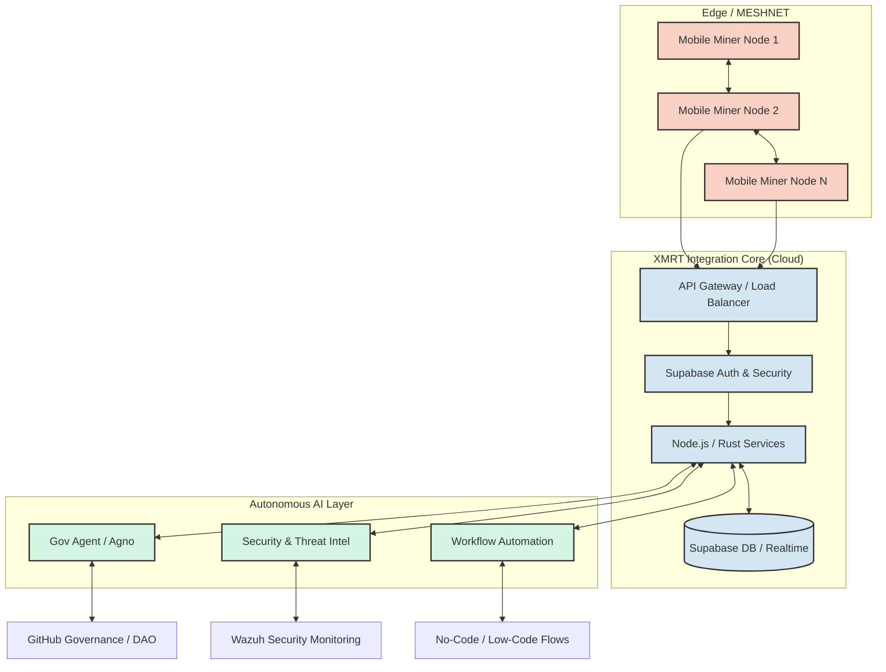
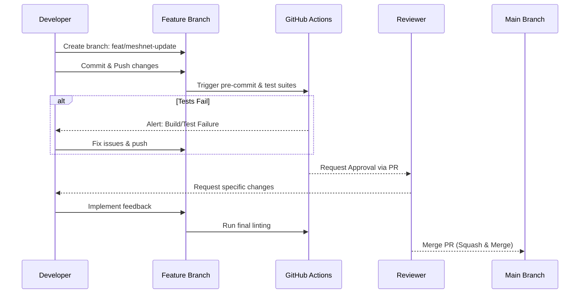
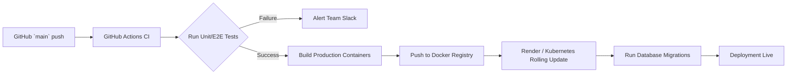

# XMRT Ecosystem V2 - Complete Central Monorepo

**Author**: XMRT Executive Council & AI Assistants  
**Version**: 2.0.0  


Welcome to **XMRT Ecosystem V2**, the comprehensive and unified monorepo for the decentralized XMRT (Monero Mobile Mining) platform. This documentation is your definitive guide to understanding, deploying, developing, and contributing to the most advanced ecosystem for mobile crypto-mining, autonomous DAO governance, and privacy-first financial operations.

---

## 1. Project Overview

### Purpose and Scope
The XMRT_EcosystemV2 repository is the central nervous system of the XMRT project. Previously spread across more than 30 specialized repositories, the platform has been consolidated to enhance collaboration, streamline deployments, and maintain robust interconnected services. The purpose of this monorepo is to unify the frontend applications, the scalable backend infrastructure, robust AI automations, and cutting-edge MESHNET capabilities for mobile Monero mining into one standardized environment.

### Relationship to the Ecosystem
This repository acts as the master reference implementation and coordination point for the `XMRT` suite. It consumes submodules and tightly couples agentic AI behaviors with web dashboards, secure mobile applications (`xmrt-mobile`), and on-chain governance systems (`xmrt-governance`). Everything required to launch the full network is contained or referenced directly within these walls.

### Target Audience and Use Cases
*   **Mobile Miners**: Users running the XMRT application to process blocks via mobile devices, relying on offline capabilities (`AirCom-ESP32-wifi-halow`).
*   **DAO Members**: Token holders participating in decentralized governance via the `xmrt-gov-ui-kit`.
*   **Ecosystem Developers**: Core contributors building out new workflows, enhancing AI agents (using `xmrt-agno`), or implementing robust real-time tracking algorithms.
*   **Node Operators**: Individuals deploying instances of the API, databases, and monitoring stacks to secure the network and provide gateway capabilities.

### Business Value Proposition
By migrating to a monorepo architecture infused with autonomous AI oversight, XMRT enables rapid iteration, reduces infrastructure overhead, and allows seamless integration of advanced features such as offline MESHNET mining and real-time visualization. It lowers the barrier to entry for mobile crypto participation while maintaining true decentralization and top-tier security parameters.

---

## 2. Architecture Documentation

The architectural backbone relies on a specialized event-driven microservices model combined with deterministic orchestration. Our core orchestration handles asynchronous communications across edge devices (mobile nodes) and centralized cloud instances.

### High-Level System Architecture Diagram



### Component Descriptions and Interactions
*   **Frontend Apps (`apps/`)**: React and Next.js applications functioning as User Dashboards, Governance portals, and Mesh monitoring layers. They interact with the Integration Core via GraphQL/REST.
*   **Integration Core (`packages/@xmrt/integration-core`)**: Provides the routing, load balancing, payload validation, and service discovery that bind the entire monorepo together.
*   **Supabase Backend**: Manages user authentication, role-based access control, persistent data storage (PostgreSQL), and real-time websocket broadcast channels.
*   **AI Agent Subsystem (`ai-agents/`)**: Leveraging the `xmrt-agno` runtime and `xmrt-activepieces`, these agents analyze network traffic, propose governance actions automatically based on DAO feedback, and secure the application layer.

### Technology Stack Breakdown
*   **Frontend**: React.js, Next.js, TailwindCSS, `xmrt-gov-ui-kit` (Planned).
*   **Backend**: Node.js, Express, Rust, Python (for AI orchestration), `xmrt-agno` (Planned), `xmrt-activepieces` (Planned).
*   **Blockchain / Smart Contracts**: Hardhat, Solidity, Ethers.js, `xmrt-risc0-proofs` (Planned).
*   **Database**: Supabase (PostgreSQL, Realtime, Storage).
*   **Infrastructure**: Docker, Kubernetes (via internal definitions), Render.

### Data Flow and Integration Points
Data originates from either user interactions via the web dashboards or automated metrics packets sent by mobile mining nodes. These payloads hit the API Gateway, fall under immediate scrutiny from the AI Security Agent, get logged to Supabase, and invoke `xmrt-activepieces` workflows for event distribution.

---

## 3. Getting Started Guide

Follow this guide to get a local instance of the complete XMRT_EcosystemV2 up and running.

### Prerequisites and System Requirements
*   **OS**: Linux (Ubuntu 22.04+ recommended), macOS, or Windows via WSL2.
*   **Node.js**: v18.0.0 or higher.
*   **Package Manager**: `npm` v9.x or `yarn` v1.22+.
*   **Docker & Docker Compose**: Necessary for running local instances of Supabase, Redis, and monitoring tools.
*   **System Specs**: Minimum 8GB RAM, 4 CPU cores. For full integration tests, 16GB RAM is highly recommended due to multiple microservices.

### Installation and Setup Instructions
1.  **Clone the Repository**:
    ```bash
    git clone https://github.com/DevGruGold/XMRT_EcosystemV2.git
    cd XMRT_EcosystemV2
    ```
2.  **Install Global Dependencies**:
    The repository leverages Lerna and standard npm workspaces.
    ```bash
    npm run install:all
    ```

### Environment Configuration
1.  Copy the provided `.env.example` configurations to `.env`.
    ```bash
    cp .env.example .env
    ```
2.  Populate required values. The minimum configuration requires valid Supabase credentials (even if running locally) and basic API gateway keys. You must also supply dummy RPC URLs if doing smart contract work.

### First-Time User Walkthrough
To verify your setup, boot the local development environment:
1.  Launch infrastructure dependencies:
    ```bash
    docker-compose -f docker-compose.dev.yml up -d
    ```
2.  Start the backend API and agent runtimes:
    ```bash
    npm run dev
    ```
3.  If you need to build the frontend web portal:
    ```bash
    npm run build:frontend
    ```
4.  Navigate to `http://localhost:8080`. You should see the unified XMRT landing dashboard. Log in using the default admin credentials noted in your `.env`.

---

## 4. Development Guide

We adhere to clear organizational principles and an agile code structure to prevent the "mud-ball" effect common to monorepos.

### Code Structure and Organization
*   `/apps`: Contains independent deployable applications (`api`, `mobile`, `web`).
*   `/packages`: Shared libraries, integrations, and tools (e.g., `integration-core`, `shared`, `ui`).
*   `/ai-agents`: Machine learning pipelines, prompt registries, and workflow scripts.
*   `/contracts`: Solidity smart contracts, deployment manifests, and ABI exports.
*   `/infrastructure`: Terraform modules, Kubernetes manifests, and Dockerfiles.

### Development Environment Setup
We utilize ESLint, Prettier, and TypeScript strictly.
Run `npm run lint` and `npm run test` before every commit. You are encouraged to configure IDE plugins for auto-formatting on save using the root `.prettierrc` and `.eslintrc.js`.

### Developer Workflow Diagram



### Contribution Guidelines and Workflow
1.  Branch from `main` using the `type/issue-number-description` format (e.g., `feat/245-add-mesh-sync`).
2.  Write clear, passing unit tests (`npm run test:unit`).
3.  Ensure the documentation reflects your architectural changes.
4.  Submit a PR and assign at least one member of the core architecture team for review.

---

## 5. API Documentation

Our unified API surfaces GraphQL, REST endpoints, and WebSocket channels for varied use cases. 

### Available Endpoints and Their Purposes
*   **`GET /api/health`**: Retrieves current uptime metrics, active node count, and global hash rates.
*   **`GET /api/mesh/nodes`**: Retrieves the list of active offline mesh networks currently synchronized.
*   **`GET /api/governance/proposals`**: Lists all active and closed DAO proposals along with live voting tallies.
*   **`GET /api/system/status`**: Main gateway for overall system telemetry and operational status.

### Request/Response Formats
All requests to the backend require standard JSON payloads with Content-Type header `application/json`.
Standard response schema:
```json
{
  "status": "success", 
  "data": { ... },
  "metadata": { "timestamp": "2026-04-11T12:00:00Z" }
}
```

### Authentication and Authorization
Authentication handles via Supabase JWTs. All protected routes require an `Authorization: Bearer <TOKEN>` header. Role-Based Access Control (RBAC) sits on the integration core, distinguishing between `miner`, `investor`, `admin`, and `agent` roles.

### Rate Limiting and Quotas
Public, unauthenticated endpoints are strictly rate-limited at 60 requests per minute per IP. Authenticated endpoints have tiered limits depending on user roles, generally defaulting to 1000 requests per minute to accommodate power users.

---

## 6. Deployment Guide

Migrating the XMRT Ecosystem V2 into production requires orchestrating multiple interconnected services.

### Production Deployment Instructions
Our CI/CD pipeline deploys automatically based on branches, but manual or self-hosted deployment typically follows these steps:
1. Build the packages locally/on a build server:
   ```bash
   npm run build
   ```
2. Build the Docker images according to the provided `render.yaml` or `Dockerfile`.
3. Provision the PostgreSQL database strictly as an external managed service (e.g., AWS RDS or Supabase Cloud).

### Deployment Flowchart



### Environment Variables and Secrets Management
Never push production secret keys to version control. Production environment variables are injected natively via Render, AWS Secrets Manager, or GitHub Secrets. Required secrets include `SUPABASE_SERVICE_ROLE_KEY`, `JWT_SECRET`, and API keys for AI/Agents (`OPENAI_API_KEY`).

### Scaling and Performance Optimization
XMRT is horizontally scalable. The Node.js Core API can expand behind a load balancer without race conditions as long as Postgres/Redis connections are properly pooled. Use `xmrt-perfetto-tracing` heavily during high-load periods to identify caching bottlenecks in the frontend. 

---

## 7. Troubleshooting Section

When dealing with a complex suite of integrations, problems occasionally arise. Below are the standard operating procedures.

### Common Issues and Solutions
*   **Database connection refused**: Ensure `docker-compose.dev.yml` is running, and that the specified ports in your `.env` perfectly match the docker containers (usually `5432`). 
*   **OOM (Out Of Memory) Crashes during `npm install`**: Lerna can aggressively attempt to parallel install across all packages. Use `npm install --workspace-concurrency=1` to slow down the installation.
*   **Agent Runtime Unresponsive**: Verify that your `.env` contains valid keys for the AI integration endpoints and that Redis is running locally.

### Debugging Tips and Tools
Utilize structured logging. The Node.js endpoints emit logs via Winston in JSON format. Use `@xmrt/mesh-protocol`'s built-in inspect mode by starting the API with `DEBUG=xmrt:* npm run start:api`.

### Performance Optimization Guidelines
If encountering lag with React web portals, verify that multi-threaded Web Workers are enabled in your browser, particularly when viewing computationally heavy 3D visualizations.

### Security Considerations
*   Never reuse testnet mnemonic seeds on mainnet.
*   Keep the `.env` strictly locked to `.gitignore`.
*   Regularly rotate API keys managed in the infrastructure repository.

---

## 8. Community & Support

Our community is the heartbeat of the decentralized network. Engaging closely ensures ongoing stability.

### Links to Community Channels
*   **Discord**: [Join the XMRT Developer Hub](https://discord.gg/example-xmrt-hub)
*   **Telegram**: [XMRT Announcements & Trading](https://t.me/example_xmrt)
*   **Twitter/X**: [@XMRT_Ecosystem](https://twitter.com/example)

### Support Request Process
If you face difficulties not covered in the troubleshooting guide, post in the `#dev-support` channel on Discord. Include your specific OS, error stack traces, and relevant configuration snippets.

### Bug Reporting Guidelines
Please use the GitHub Issues tracker to document bugs. Include reproducible steps, expected behavior vs. actual behavior, and context (e.g. log files).

### Feature Request Process
Feature requests are managed exclusively via the DAO structure (`xmrt-gov-ui-kit`). Do not submit issues requesting arbitrary features without a corresponding, accepted DAO proposal reflecting community intent.

---

## 9. Visual Elements Overview
*As detailed in the architecture section above, the system relies deeply on visualizing workflows.*
*   **Architecture Flow (Section 2)**: Displays how Edge devices integrate with the centralized core.
*   **CI/CD Dev Workflow (Section 4)**: Maps branches to GitHub actions and tests.
*   **Production Deployment (Section 6)**: Illustrates the containerized progression.

---

## 10. Maintenance & Updates

### Versioning Strategy
This repository strictly follows **Semantic Versioning 2.0.0** (`MAJOR.MINOR.PATCH`). Since it operates as a monorepo, packages heavily tied together share `MAJOR` version releases, while internal unlinked packages adhere to independent `PATCH` increments.

### Update Procedures
Dependency updates are managed via Dependabot configured in `.github/dependabot.yml`. Critical security patch updates are merged within 24 hours directly by the governing bots if tests pass. 

### Backward Compatibility Considerations
Our API Gateway (Section 5) supports routing by version (e.g. `/api/v1/` vs `/api/v2/`). Deprecated endpoints remain functional for approximately two quarterly release cycles (6 months) before sunsetting.

### Deprecation Policies
If an external API service or specific architecture changes drastically (e.g., migrating a service out of Supabase into Custom Rust infrastructure), a deprecation notice will emit warning logs directly to affected client software three months in advance.

---

*Thank you for contributing to XMRT_EcosystemV2 and supporting the decentralized mobile Monero ecosystem.*
